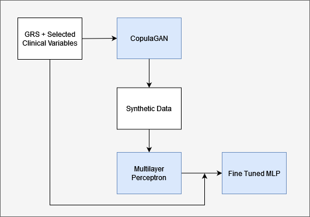

# Assessing VTE in cancer patients using deep learning synthetic data generation and domain adaptation techniques.
 
 This repository contains the code for my master's thesis. The repository is organized into three folders, each encompassing the necessary code and a requeriments.txt file to replicate specific experiments. Please note that due to the sensitive nature of the dataset, which contains clinical information of real patients, it cannot be uploaded to this repository as it is not publicly available.

 ## Contributions
 
- Experiment 1: Inside this folder, you'll find two notebooks. The first notebook presents our reproduction of a paper, including the permutation test and all the analyses outlined in my master's thesis. The second notebook replicates the findings of the Oncothromb paper; however, it excludes the preprocessing step and selects directly the same variables as the original paper.
  - [Our reproduction of Oncothromb](Experiment%201/Paper_Reproduction.ipynb)
  - [Oncothromb replication](Experiment%201/Baseline%20(selection%20of%20the%20same%20variables%20as%20the%20paper).ipynb)

- Experiment 2: This folder focuses on the performance study of various state-of-the-art GANs for tabular data. It includes a separate notebook for each architecture, as well as a folder named 'model' containing the code for CTABGAN with minor modifications to suit our dataset. The other methods are trained using the SDV library. Additionally, this folder contains the '.pkl' files for some trained GANs. 
  - [CopulaGAN](Experiment%202/Tabular_GANs_study_copulaGAN.ipynb)
  - [CTGAN](Experiment%202/Tabular_GANs_study_CTGAN.ipynb)
  - [TVAE](Experiment%202/Tabular_GANs_study_TVAE.ipynb)
  - [CTABGAN](Experiment%202/Tabular_GANs_study_CTABGAN.ipynb)
- Experiment 3: This folder contains our approach combining deep learning synthetic data generation and domain adaptation techniques in order to improve the Oncothromb score.
  - [Assessing VTE in cancer patients using deep learning synthetic data generation and domain adaptation techniques.](Experiment%203/Synthetic_data_generation_and_transfer_learning.ipynb.ipynb) 
<div align="center">
  
  <p align="center"><em>Methodology proposal to improve Oncothromb score via synthetic data and transfer learning. </em></p>
</div>

## Contact
Feel free to contact me to discuss any issues, questions or comments.
- [GitHub](https://github.com/sergibech)
- [Linkedin](https://www.linkedin.com/in/sergi-bech/)

## Code citation

```bibtex
@misc{VTEBech,
  author       = {Sergi Bech},
  title        = {Assessing VTE in cancer patients using deep learning synthetic data generation and domain adaptation techniques},
  year         = {2023},
  howpublished = {GitHub repository},
  url          = {https://github.com/sergibech/Master_thesis},
  note         = {Accessed: June 20, 2023}
}


    
